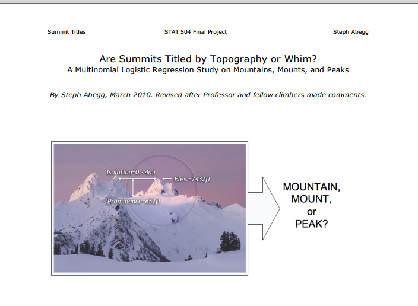
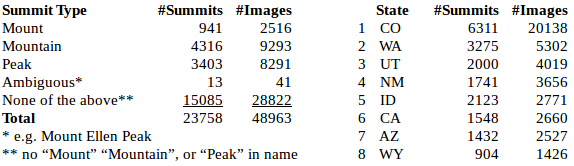
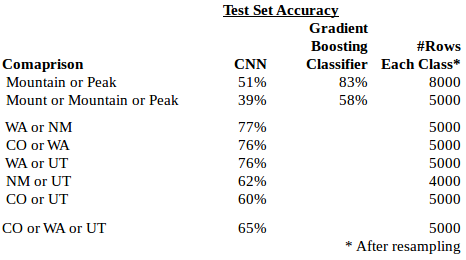
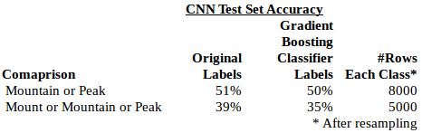

## **Classifying Mountains with Photos and Neural Networks**

This project attempts to classify mountains \(let's call them "summits"\) into certain categories, specifically \(i\) whether the summit is a named a "Mount", "Mountain", or "Peak", and \(ii\) which state the summit is in.

Note: Slides for my Capstone presentation can be found here: [https://docs.google.com/presentation/d/1oR0iwLZyZSEdzCkZShvnvSCauiFH91rXPOSVbUvOIE0/edit?usp=sharing](https://docs.google.com/presentation/d/1oR0iwLZyZSEdzCkZShvnvSCauiFH91rXPOSVbUvOIE0/edit?usp=sharing)

As I am an avid hiker, I wondered if there were any convention to why some summits are called a mount \(e.g. "Mount Evans"\), a mountain \("Green Mountain"\), or a peak \("Pikes Peak"\). Apparently, there is no convention on this "summit type", although a few years ago, a college student named Stephen Abegg did a statistical evaluation using three numbers: elevation, prominence \(how high the summit is versus the nearest saddle\), and isolation \(distance to the nearest summit\) in a multinomial logistic regression and found a pattern that works most of the time. The pattern is:

* Mounts - tend to be high elevation and prominent
* Mountains - tend to be lower elevation and rounded
* Peaks - tend  to be pointed with other summits nearby.

My idea is to see if a convolutional neural network \("CNN"\), an advanced algorithm used for classifying images, can replicate the results of the numeric regression model. While I'm at it, I thought I'd try to see the the CNN could classify the photos in other ways, e.g. predict which state the summit is in.

### Overview of Process

* Collection of data from listsofjohn: nearly 50,000 photos along with numerical data \(elevation, prominence, and isolation\)
* Replicating the regression using several numerical regression algorithms
* Properly labeling the mountains
* Building the program in Python:
  * Put all the data and references to image file locations in a PostgreSQL database
  * Preprocess the photos
  * Fit the model on various classifications \(by state or summit type\)
  * Run the fitted model on selected photo or photos of a given mountain and show the predicted classification
  * Build a user interface \("UI"\) so that anyone can pick a mountain in the database or  upload their own photo and see how the model classifies it.

### Data

I obtained all of my data from the listsofjohn.com website. listsofjohn is a website with information on nearly every summit in the United State, and it allows registered users to keep track of the summits they've hiked on the site. The administrator of the website, John Kirk, was exceptionally helpful in providing me the numerical data and links to directly download all of the nearly 50,000 photos on the website.

1. **Minimum \#Photos per Class**: A CNN needs several thousand photos in each class \(e.g. state or summit type\) in order for it to adequately classify photos. The number of images of Mounts is only 2,516, and as we go down the list of states, the number of images available drops off, so I limited it to the top four states by \#images. I had the idea of trying to classify as photo as being in the Appalachian Mountains in the east versus the Rocky Mountains in the west, but I only have a total of 1,461 images for summits in all the Appalachian states versus over 37,000 images for summits in Rocky Mountain states. Even with upsizing, the number of images for Appalachia is insufficient.
2. **Class Balance**: Ideally, classifiers should have a similar number of items in each class that is being compared, i.e. a similar number of Mounts, Mountains, and Peaks. As is seen above, I have over 8,000 images of Mountains and Peaks, but only about 2,500 Mount images. I have over 20,000 images for Colorado, but only a few thousand for the other states. Class imbalance can be addressed with **resampling**, which involves various methods of upsampling the small sized classes and downsizing the larged sized classes. For upsampling, additional images can be generated by manipulating the existing photos in certain ways, e.g. taking a horizontal mirror image of an image and counting that as a new image for that class.
3. **Ambiguous Names**: One would think that whether a summit is called a Mount, Mountain, or Peak is pretty straightforward. However, consider names like "Mount Ellen Peak", "White Mountain-South Peak",  or "Mountaineer Peak".  "Mount Ellen Peak" is clearly ambiguous, but only 13 such summits out of 23,758 needed to be removed from summit type consideration for this. If a simple algorithm is used to search for summit names with more than one type in it, "White Mountain-South Peak" would turn up, although this is clearly a Mountain with more than one high point. Likewise, "Mountaineer Peak" would show up in a simple search as having both "Mountain" and "Peak" in its name, but "Mountain" is not a whole word in this case and this is clearly a Peak. Consequently, the algorithm to properly classify the names by summit type was ridiculously complicated given expectations.
4. **Train, Test sets:** The data for each comparison was split 80% into a training set and 20% into a test set. Accuracy is the metric most commonly used for CNNs, and it was used here \(and for the numerical classifiers as well\).

### Image Processing

**Numpy Arrays**--For the CNN to process a photo, the photo is loaded into the program as an array of RGB numbers ranging from 0-255 representing the intensity of the colors of red, green, and blue. I used a widely-used library in Python called Numpy to manipulate the arrays.

**Cropping versus Zero-Padding**--As the CNN functions substantially more efficiently if all the photos are the same size, the photos, which came in varying sizes, needed to be resized to the same size. This could be done either by cropping the photos \(cutting off the edges\) on the sides where they are larger than my chosen standard photo size, or "zero-padding" could be added to the shorter sides to make them bigger. I tried it both ways to see which would work best.

**Downsize Photos**--CNN's use a considerable amount of computer processing power, and to make it easier on the computer, the photos were all downsized to the 100 x 100 pixels.

**Normalize Features**--The number in the array need to be converted to a standardized range \(I choose between 0 and 1\) in order for the CNN to work best. This was similarly done in the numerical classification \(gradient boosting was the best performer\)..

**One Hot Encoding**--The cnn requires that classes of data be encoded with one hot vectors. For example, if it is comparing whether a summit is in CO versus WA, a summit in CO would be coded as \[1, 0\] and one in WA as \[0, 1\].

### Results

Thirteen different numerical classifiers were tried on the numerical data \(elevation, isolation, and prominence\) to try to classify the summits by type. The classifier with the best performance was the gradient boosting classifier \(GBC\), which had 83% accuracy picking between a Mountain or a Peak on the test set data, but only 58% accuracy picking among Mount, Mountain, or Peak.

Recall that the data included images for 9,293 Mountains and 8,291 Peaks, but for only 2,516 Mounts. The number of Mounts is not quite sufficient to do a good comparison with a CNN, although upsampling was used to help. Therefore, both a two-way comparison of Mountain versus Peak was done, with each class resampled to 8000 summits each, as well as a three summit type comparison resampled to 5000 summits each. As with the gradient boosting classifier, the accuracy of the CNN was better on the two-way comparison \(60%\) versus the three-way \(41%\), but this performance is unimpressive and it significantly underperformed the GBC.

The CNN did much better on a two-way state-by-state comparison. As shown above, three of the state-by-state comparisons had over 80% accuracy, and another had 64% accuracy. CO versus UT had the lowest accuracy \(63%\), perhaps because the summits in western CO \(including the Colorado National Monument\) are similar to the arches and other summits in UT, and CO and UT are border states. WA is the furthest north and NM is the furthest south among the states compared, and that comparison performed the best at 84% accuracy.

Remarkably, when the CNN compared three states, CO or WA or UT, it obtained 63% accuracy, better than the CO versus UT accuracy of only 51%, but not as was as the CO versus WA accuracy of 80%.

As mentioned above, the classification of mountain types by Mount, Mountain, or Peak is not a standard by any official organization, but a naming convention that works with less than 60% accuracy using the gradient boosting classifier. Therefore, one might not expect the CNN classifier to do any better \(it does not\). However, I had the idea of using the predict function of the GBC classifier to generate labels that were used for the CNN classifier. This way, we could see if the poor performance of the CNN in comparing summit types was due to mislabeling, or that the CNN was simply incapable of making the distinction. As shown above, using the GBC generated labels had a slightly NEGATIVE effect on the the results. I expected an improvement in the results, so I am surprised by this outcome.

If, in fact,  the elevation, isolation, and prominence of the summits determines its naming convention, then the photos would have to show this. In particular, the photos would need to show the summits with their surrounding summits nearby. Some of the photos do this, but others do not.
