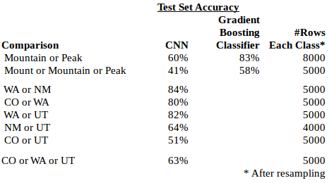

## **Classifying Mountains Using Neural Networks**

This project uses a convolutional neural network ("CNN") to classify photos of mountains \(let's call them "summits"\) into certain categories, specifically \(i\) whether the summit is a named a "Mount", "Mountain", or "Peak", or \(ii\) which state the summit is in.

Note: Slides for my Capstone presentation can be found here: [https://docs.google.com/presentation/d/1oR0iwLZyZSEdzCkZShvnvSCauiFH91rXPOSVbUvOIE0/edit?usp=sharing](https://docs.google.com/presentation/d/1oR0iwLZyZSEdzCkZShvnvSCauiFH91rXPOSVbUvOIE0/edit?usp=sharing)

As I am an avid hiker, I wondered if there is any convention to why some summits are called a mount \(e.g. "Mount Evans"\), a mountain \("Green Mountain"\), or a peak \("Pikes Peak"\). Apparently, there is no naming convention for summit type, although a few years ago, a college student named Stephen Abegg did a statistical evaluation using three numbers, elevation, isolation \(distance to the nearest summit\), and prominence \(how high the summit is versus the nearest saddle\), in a multinomial logistic regression and found a pattern that works most of the time. The pattern is:

* Mounts - tend to be high elevation and prominent
* Mountains - tend to be lower elevation and rounded
* Peaks - tend  to be pointed with other summits nearby.

My idea is to see if a convolutional neural network, an advanced algorithm used for classifying images, can replicate the results of the statistical regression model. While I'm at it, I thought I'd try to see the the CNN could classify the photos as to whether they are in one state or another \(e.g. Washington or New Mexico\).

### Overview of Process

* Collection of data from listsofjohn: nearly 50,000 photos along with numerical data \(elevation, prominence, and isolation\)
* Replicating the regression using several numerical regression algorithms
* Properly labeling the mountains
* Building the program in Python:
  * Put all the data and references to image file locations in a PostgreSQL database
  * Preprocess the photos
  * Fit the model on various classifications \(by state or summit type\)
  * Run the fitted model on selected photo or photos of a given mountain and show the predicted classification

### Data

I obtained all of my data from the listsofjohn.com website. listsofjohn is a website with information on nearly every summit in the United State, and it allows registered users to keep track of the summits they've hiked on the site. The administrator of the website, John Kirk, was exceptionally helpful in providing me the numerical data and links to directly download all of the nearly 50,000 photos on the website.

1. **Minimum \#Photos per Class**: A CNN needs several thousand photos in each class \(e.g. state or summit type\) in order for it to adequately classify photos. As we go down the list of states, the number of images available drops off, so I limited it to the top four states by \#images. I considered trying to classify a photo as being in the Appalachian Mountains in the east versus the Rocky Mountains in the west, but I only have a total of 1,461 images for summits in all the Appalachian states versus over 37,000 images for summits in Rocky Mountain states. Even with upsizing, the number of images for Appalachia is insufficient.
2. **Class Balance**: Ideally, classifiers should have a similar number of items in each class that is being compared, i.e. a similar number of Mounts, Mountains, and Peaks. As is seen above, I have over 8,000 images of Mountains and Peaks, but only about 2,500 Mount images. I have over 20,000 images for Colorado, but only a few thousand for the other states. Class imbalance can be addressed with **resampling**, which involves various methods of upsampling the small sized classes and downsizing the larged sized classes. For upsampling, additional images can be generated by manipulating the existing photos in certain ways, e.g. taking a horizontal mirror image of an image and counting that as a new image for that class.
3. **Ambiguous Names**: One would think that whether a summit is called a Mount, Mountain, or Peak is pretty straightforward. However, consider names like "Mount Ellen Peak", "White Mountain-South Peak",  or "Mountaineer Peak".  "Mount Ellen Peak" is clearly ambiguous, but only 13 such summits out of 23,758 needed to be removed from summit type consideration for this. If a simple algorithm is used to search for summit names with more than one type in it, "White Mountain-South Peak" would turn up, although this is clearly a Mountain with more than one high point. Likewise, "Mountaineer Peak" would show up in a simple search as having both "Mountain" and "Peak" in its name, but "Mountain" is not a whole word in this case and this is clearly a Peak. Consequently, the algorithm to properly classify the names by summit type was ridiculously complicated given expectations.
4. **Train, Test sets:** The data for each comparison was split 80% into a training set and 20% into a test set. Accuracy is the metric most commonly used for CNNs, and it was used here \(and for the numerical classifiers as well\).

### Image Processing

**Numpy Arrays**--For the CNN to process a photo, the photo is loaded into the program as arrays of RGB numbers ranging from 0-255 representing the intensity of the colors of red, green, and blue. I used a widely-used library in Python called Numpy to manipulate the arrays.

**Cropping versus Zero-Padding**--As the CNN functions substantially more efficiently if all the photos are the same size, the photos, which could have varying sizes, needed to be resized to the same size. This could be done either by cropping the photos \(cutting off the edges\) on the sides where they are larger than my chosen standard photo size, or "zero-padding" could be added to the shorter sides to make them bigger. I tried both ways, and the padded photos provided the best results.

**Downsize Photos**--CNN's use a considerable amount of computer processing power, and to make it easier on the computer, the photos were all downsized to the 100 x 100 pixels.

**Normalize Features**--The numbers in the array need to be converted to a standardized range \(I choose between 0 and 1\) in order for the CNN to work best. This was similarly done in the numerical classification.

**One Hot Encoding**--The CNN requires that classes of data be encoded with one hot vectors. For example, if it is comparing whether a summit is in CO versus WA, a summit in CO would be coded as \[1, 0\] and one in WA as \[0, 1\].

### Results

Thirteen different statistical classifiers were tried on the numerical data \(elevation, isolation, and prominence\) to try to classify the summits by type. The classifier with the best performance was the gradient boosting classifier \(GBC\), which had 83% accuracy picking between a Mountain or a Peak on the test set data, but only 58% accuracy picking among Mount, Mountain, or Peak. The results of the GBC were compared to the results of the CNN classification.

Recall that the data included images for 9,293 Mountains and 8,291 Peaks, but for only 2,516 Mounts. The number of Mounts is not quite sufficient to do a good comparison with a CNN, so upsampling was used to address this. Both a two-way comparison of Mountain versus Peak was done, with each class resampled to 8000 summits each, as well as a three summit type comparison resampled to 5000 summits each. As with the gradient boosting classifier, the accuracy of the CNN was better on the two-way comparison \(60%\) versus the three-way \(41%\), but this performance is unimpressive and it significantly underperformed the GBC.

The CNN did much better on a two-way state-by-state comparison. Random guessing between two states would generally get you 50% accuracy. With the exception of CO vs UT, the CNN sigfniciantly outperformed random guessing. As shown above, three of the state-by-state comparisons had over 80% accuracy, and another had 64% accuracy. CO versus UT had the lowest accuracy \(51%\), perhaps because the summits in western CO \(including the Colorado National Monument\) are similar to the arches and other summits in UT, and CO and UT are border states. WA is the furthest north and NM is the furthest south among the states compared, and that comparison performed the best at 84% accuracy.

Remarkably, when the CNN compared three states, CO or WA or UT, it obtained 63% accuracy, better than the CO versus UT accuracy of only 51%, but not as was as the CO versus WA accuracy of 80%. Random guessing among three states would generally provide 33% accuracy, so it did outperform random guessing.

As mentioned above, the classification of mountain types by Mount, Mountain, or Peak is not a standard by any official organization, and the gradient boosting classifier had less than 60% accuracy in classifying among these three. Therefore, it is not surprising that the CNN classifier does not do any better. However, I had the idea of using the predict function of the GBC classifier to generate labels that were used for the CNN classifier--in effect renaming the summits in accordance with the elevation/isolation/prominence convention. This way, we could see if the poor performance of the CNN in comparing summit types was due to being trained and tested against inconsistent labels, or that the CNN was simply incapable of making the distinction due to insufficient information in the photos. As shown above, contrary to my expectations, using the GBC generated labels had a slightly NEGATIVE effect on the the results, suggesting the photos do not contain enough information for the CNN to distinguish among the three mountain types.

If, in fact,  the elevation, isolation, and prominence of the summits determines its naming convention, then the photos would have to show this. In particular, the photos would need to show the summits with their surrounding summits nearby. A few of the photos do this, but others do not.

### **Description of CNN Architecture**

CNN’s are constructed with multiple layers, and the selection of layers and their sequence can vary. Various CNN architectures presented in academic papers and competitions have generated various results for different types of classifications. I used an architecture that is similar to one that was successfully used in classifying MNIST handwriting images of numbers. Further, most layers of the CNN have hyperparameters which can tune the CNN for better or worse results. I experimented with different hyperparameters and managed to obtain better results than the model I started with.

Running a CNN is computationally expensive. Each run of the CNN with specific hyperparameters takes several hours, so the opportunity to experiment with many different combinations of CNN architecture and hyperparameters is limited by time \(and expense if running the CNN on e.g. Amazon Web Services\). Therefore, I selected a CNN architecture that has shown success in previous applications, experimented with hyperparameters, and then used the resulting model.

The architecture of the CNN I employed is shown below.

I used the sequential model of Keras to implement my CNN. The layers are as follows:

1. _Conv2d_ The photos \(which were previously pre-processed by zero-padding and downsized to 100x100x3—see below\) are input into the first Conv2d layer. This first convolutional layer scans the photo for lower level shapes, e.g. lines and curves.

2. _Activation_ This uses the relu function to convert non-negative numbers to zero.

3. _Conv2d_ This convolutional layer scans the output of the above for higher level shapes.

4. _Activation_ This again uses the relu function.

5. _MaxPooling_ This downsized the multi-dimensional array into smaller arrays to make them computationally easier to process.

6. _Dropout_ As the CNN has many dimensions to it, the Dropout layer regularizes the data to reduce overfitting.

7. _Flatten_ The multi-dimensional array is flattened into a single dimensional array for use by the multi-layer perceptron.

8. _Dense_ This is a fully-connected 128 layer perceptron that starts the classification.

9. _Activation_ Again, a relu function.

10. _Dropout_ Another regularization to contain overfitting.

11. _Dense_ Another fully-connected multi-layer perceptron. This layer has the same number of classes as the final classification, e.g. if comparing CO vs UT, it would have two classes.

12. _Activation_ This uses a softmax function to generate probabilities that a photo falls into each class being considered. For example, if the classification is CO vs UT, the output might be .89 and .11, meaning that the CNN predicted an 89% chance the image is from CO and an 11% chance that it is in UT.

### **Outline of Software Modules in this Repo**

In general, I use Keras’ _sequential_ CNN model to run the photo classification, and sklearn’s _GradientBoostingClassifier_ on the elevation, isolation, and prominence data to run the statistical classification to compare with the photo classification results. The data and file locations for the images are stored in a postgresql \(PSQL\) database. This allows for easily calling up photos for the various classification, e.g. if I wanted all photos in CO and UT, a PSQL SELECT statement could filter those summits and provide the filenames for the associated images. Also, the parameters used and the accuracy results obtained from the classifications are also stored in the PSQL database.

_DownloadData.py_ and _use\_google\_geocoding\_to\_update\_state\_in\_db.py_

The data used in this project is proprietary, so the _DownloadData.py_ is not included in this repo. I obtained from the listsofjohn website administrator an Excel spreadsheet that included the list of summits, each summit’s elevation, isolation, prominence, latitude and longitude, and links to download the image\(s\) for each summit. I downloaded the data for the nearly 24,000 summits and 50,000 images. I needed a unique state for each summit, so the _use\_google\_geocoding\_to\_update\_state\_in\_db.py_ inputs into Google Geocoding each summit’s latitude and longitude to obtain the unique state each summit is in.

_sql.sql_ and _insert\_into\_summitsdb.py_

I created a PSQL database \(summitsdb\) to store all the data for the summits and images and the results of the classifications. The summitsdb includes the _summits_ table for each unique summit, the _images_ table \(with a foreign reference to the _summits_ table\) listing the filename where the image\(s\) for each summit are stored, and the _model\_fit\_results_ table to store the classification type, CNN parameters, and resulting accuracy results for each run of cnn\_class. The SQL used to create the tables and query them is in the _sql.sql_ file, and the_ insert\_into\_summitsdb.py_ was used to insert the data from the listsofjohn spreadsheet into the _summits_ and _images_ tables.

_process\_photos\_square\_cropped\_padded.py_

For the CNN to function efficiently and reliably, it needs all photos to be a standard size and preferably downsized to reduce computational requirements. All the photos downloaded from listsofjohn.com were 400x300 pixels, although 78 of them \(out of nearly 50,000\) could not be downloaded properly and were discarded from the database. I tried running the CNN with the photos in three different formats: \(i\) the original 400x300 pixels, \(ii\) cropping the width of the photos to make them 300x300 pixels square, and \(iii\) using zero-padding along the top and bottom of the photos to make them 400x400 square. _By far, the best results were obtained from the square zero-padded photos_, so I used that throughout the rest of the project. After the photos were zero-padded, they were downsized to 100x100 pixels and stored in pickle files for the CNN to use, and the corresponding labels for the images \(mountain, mount, or peak, and the summit’s state\) were also stored in pickle files. \(Note: the images are actually 100x100x3 dimensions, with the x3 representing the RGB colors\).

_cnn\_train.py_

This is the core module that takes the pre-processed photos and runs the classifications on them. It loops through each classification \(e.g. CO vs UT\), prepares the data, runs the CNN on the photos, and runs the gradient boosting classifier on the elevation, isolation and prominence data. The accuracy results of the classifiers, as well as the CNN parameters used, are stored in the summitsdb _model\_fit\_results_ table. The key parts of this _cnn\_train.py_ module are:

* _main_: This starts by loading all of the pre-processed images and their labels, and it loads in the elevation, isolation, and prominence data from the summitsdb for use by the gradient boosting classifier. A couple of Python lists store the type of classification to be run, and the CNN parameters to use. These two lists are combined and passed to the run function below in the \*\*params parameter. The two lists are \(i\) the _run\_params_ list, which contains the number of rows each class is resized to, a list of each type of classification to be run \(e.g. mountain vs. peak or CO vs UT\), the type of classification \(type—mountain vs, peak, etc. or state—state by state\), and which parameters to compare\(e.g. CO vs UT\), and \(ii\) the \__cnn\_params_ list, which contains a list of the specific hyperparameters to run the CNN with. A for loop loops through each element in the _run\_params_, instantiates a new _cnn\_class_ with a model number representing this run of the model with the associated _cnn\_params_, and calls the class’s _run_ functino to run the classifiers with those parameters.

* _cnn\_class_ A class is used to isolate each run of the classifiers with specific parameters. The class is instantiated with a _model\_num_ \(a sequential integer\) representing the parameters that the CNN was run with. Each function of _cnn\_class_ follows.

* _run_ This function’s parameters are all the images and labels, the classification type \(by summit type or by state\), and a list of the CNN parameters to be used. It calls in turn each of the following functions which prepare the data, run the classifiers, and record the results.

* _filter\_images_ This function takes all the images and labels in the database as numpy arrays, and the labels to be filtered, and returns just the filtered images and labels. For example, if this run is for a state-by-state comparison of CO versus UT, all the images and state labels \(as two letter strings\), along with “CO” and “UT”, are passed as parameters, and this function returns only the images and labels for CO and UT. Furthermore, the state labels are converted from strings into 0s and 1s. If three labels were being filtered, e.g. mounts, mountains, and peaks, then 0s, 1s, and 2s would be returned as the new labels.

* _balance\_classes_ In order for a classifier to work properly, it should have nearly the same number of rows in each class being compared. As mentioned previously, the data I obtained contains significant class imbalance issues. This function addresses the class imbalance by making the number of row in each class the same using upsampling and/or downsampling of the classes. It takes the filtered images or data \(elevation, isolation, and prominence\) and associated labels, and the desired number of rows per class \(_numrows\_in\_each\_class_\), and returns X and y numpy arrays with the same _numrows\_in\_each\_class_ in each class. In cases where images in a class need to be upsampled, some of the added images are flipped horizontally using the _make\_different\_images_ function. Where needed, sklearn’s _resample_ library is used for upsampling or downsampling.

* _make\_different\_images_ This function simply takes the images that are passed to it and uses python slicing to horizontally flip the images. This is used for upsampling some of the images.

* _one\_hot\_encode\_labels_ This function takes the labels, which were in _filter\_images_ converted to sequential integers, and converts them into one hot vectors which the CNN library requires.

* Back in the _run_ function, the X data is normalized to a range of 0 to 1, and then the X and y data are split 80%/20% into train/test sets.

* _fit\_cnn_ This is the function that does the CNN classification. Its parameters include the train and test sets, and the CNN parameters that were passed originally by the _\_\_main\_\__ section. The \_sequential_ library of Keras is used, and the layers of the CNN with their associated parameters are constructed. The CNN model is compiled and then fit on the train data. Then Keras’ _sequential_ model.evaluate\(\) function is called on the test data, and the accuracy results are recorded. The classification type, the CNN parameters, and the accuracy results are then inserted into the summitsdb _model\_fit\_results_ table along with the model number this particular cnn\_class was instantiated with. Also, the fitted model is saved in a JSON file for later use \(e.g. to classify a single photo that may be uploaded later\).

* _run\_GradientBoosting_ This function takes the elevation, isolation, and prominence data and the associated labels and runs the gradient boosting classifier. The summitsdb _model\_fit\_results_ table is updated with the gradient boosting accuracy results.

I regularly use print statements in the above modules to show the user the progress of the programs being run.

The _cnn\_fit_ function stores the fitted CNN models for later use. An additional module, _cnn\_predict_, is considered for future development to allow a user to upload an individual photo and have it classified using the previously saved fitted models.
